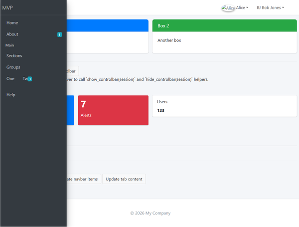

# Examples Gallery 🖼️

This page shows screenshots of the library's example apps. If you want to
generate your own screenshots (for documentation or PR previews), run the
capture helper which uses Playwright to render pages and save images.

Generate screenshots (local)

1. Install Playwright and browsers:

```bash
pip install playwright
playwright install
```

2. Capture screenshots for one or more examples:

```bash
python scripts/capture_gallery_screenshots.py --examples examples/mvp_shiny.py --out docs/images
```

The script will start the example on a free port, wait for the app to be
ready, open it in a headless browser, and save a screenshot to
`docs/images/<example>.png`.

Gallery (auto-updates when you run the capture script)

<!-- Add screenshots below by running the capture script -->

- MVP Shiny example

  

- Themed MVP example (overrides CSS variables)

  


Theming — before / after

<!-- GALLERY_METADATA_START -->
*Metadata about the latest generated gallery images will appear here after CI updates.*
<!-- GALLERY_METADATA_END -->

Below is a quick before/after showcase using a small CSS override that changes the avatar color and badge appearance. Run the capture helper to generate the images and thumbnails shown.

Example CSS override (from `examples/assets/custom_theme.css`):

```css
:root {
  --bs4dash-avatar-bg: #1f7a8c; /* teal */
  --bs4dash-avatar-fg: #ffffff;
  --bs4dash-avatar-md-size: 40px;
  --bs4dash-avatar-md-font: 16px;
}
.badge.badge-info { background-color: #ff6b6b; color: #fff; }
```

Before (default):

- Full: 
- Thumb: 

After (themed):

- Full: 
- Thumb: 

Notes and limitations


Notes and limitations

- Playwright requires system dependencies for the browser engines — see
  Playwright docs if you encounter missing packages on Linux or Windows.
- The example scripts run with `PYBS4DASH_PORT` set by the capture helper.
- If images are not present, you can still preview the examples by running
  them locally with `python examples/mvp_shiny.py` and opening the page.

Publishing generated images automatically (optional)

If you want the CI job to automatically push generated images directly to the `main` branch, set a repository secret named `GALLERY_PUSH_TOKEN`.
This token should be a Personal Access Token (PAT) with minimal write
access to the repository. Two common approaches are listed below.

Option A — Machine user (recommended for automation)

1. Create a dedicated GitHub machine/bot user (separate account) to
   isolate the token from your personal account.
2. Grant the machine user write access to the repository (Collaborator or
   add to a team with write permissions).
3. As the machine user, create a PAT:
   - Settings → Developer settings → Personal access tokens → Generate new
     token (or create a Fine‑Grained Token scoped to the target repo).
   - **Scopes:** prefer a Fine‑Grained Token with repository access set to
     the target repository and **Contents: Read & Write** (or `repo` for a
     classic token). Keep scopes minimal.
4. Add the token to the repository secrets:
   - Repo → Settings → Secrets and variables → Actions → New repository
     secret → Name: `GALLERY_PUSH_TOKEN` → Value: *your-token* → Save.
   - Or use GitHub CLI:

```bash
# Replace with your repository full name
REPO=owner/repo
# Paste your PAT into $PAT (e.g., read from a secure input)
gh secret set GALLERY_PUSH_TOKEN --body "$PAT" -R $REPO
```

Option B — Use your personal PAT (less ideal for automation)

- Same steps as above, but generate the token from your user account and
  add it to the repository secrets. Be sure to **rotate** or revoke the
  token if you no longer need CI to push images.

Security notes

- Use **fine-grained tokens** when possible and grant the smallest scope
  required. Avoid giving broad `repo` scopes if only content push is
  needed.
- Store tokens in repository secrets (or organization secrets for
  multiple repos) — never check tokens into the repo.
- Rotate tokens regularly and revoke tokens for deleted machine users.

Test the setup

1. Add `GALLERY_PUSH_TOKEN` to the repository secrets (via UI or `gh` CLI).
2. Manually trigger the workflow (Actions → Capture Gallery Screenshots → Run workflow) and verify the `Optional: Commit images to main` step runs and updates the `main` branch.
3. If the step did not run, ensure the secret exists and the token has
   sufficient write access to the repository.
